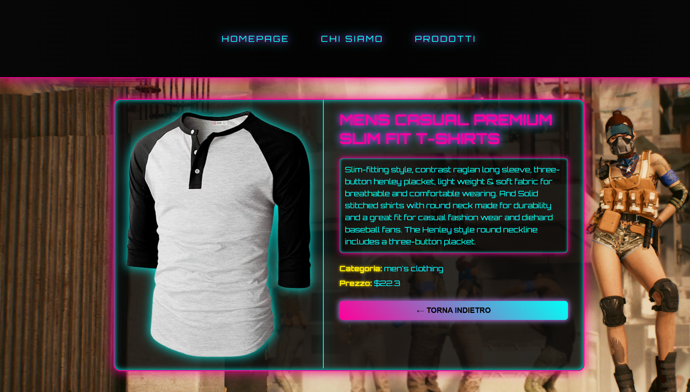

<h1 align="center">React-router</h1>

###

  
  
  
  
  
  
  
  
  

###

  Esercizio di oggi: React Router Store  repo: react-router  Consegna  Creiamo il frontend del nostro mini e-commerce e le sue pagine principali! Useremo Fake Store API come backend fittizio per simulare i dati dei prodotti.  https://fakestoreapi.com/  Obiettivi  Installiamo React Router DOM: npm i react-router-dom Creiamo almeno 3 pagine principali: Homepage (con un messaggio di benvenuto o immagine promozionale) Chi siamo Prodotti (pagina che mostrerà la lista dei prodotti prendendoli da https://fakestoreapi.com/products) Implementiamo una Navbar visibile in tutte le pagine per navigare tra di esse  Bonus  Centralizziamo la Navbar usando un componente Layout Gestiamo la classe active per i link attivi nella Navbar

###

# React + Vite

This template provides a minimal setup to get React working in Vite with HMR and some ESLint rules.

Currently, two official plugins are available:

- [@vitejs/plugin-react](https://github.com/vitejs/vite-plugin-react/blob/main/packages/plugin-react) uses [Babel](https://babeljs.io/) (or [oxc](https://oxc.rs) when used in [rolldown-vite](https://vite.dev/guide/rolldown)) for Fast Refresh
- [@vitejs/plugin-react-swc](https://github.com/vitejs/vite-plugin-react/blob/main/packages/plugin-react-swc) uses [SWC](https://swc.rs/) for Fast Refresh

## React Compiler

The React Compiler is not enabled on this template because of its impact on dev & build performances. To add it, see [this documentation](https://react.dev/learn/react-compiler/installation).

## Expanding the ESLint configuration

If you are developing a production application, we recommend using TypeScript with type-aware lint rules enabled. Check out the [TS template](https://github.com/vitejs/vite/tree/main/packages/create-vite/template-react-ts) for information on how to integrate TypeScript and [`typescript-eslint`](https://typescript-eslint.io) in your project.
